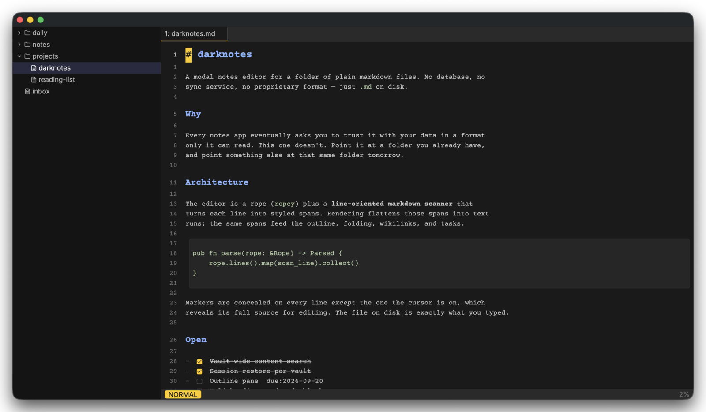

# darknotes

A modal, keyboard-driven notes editor for a folder of plain markdown files.

darknotes opens a directory — a *vault* — and gets out of the way. Your notes
stay ordinary `.md` files on your own disk: no database, no sync service, no
account, no proprietary format. Point it at a folder you already have, and point
anything else at that same folder tomorrow.

It is built on [GPUI](https://www.gpui.rs/), the GPU-accelerated UI framework
behind the Zed editor, and it edits like vim because it implements a real
subset of vim's grammar rather than a handful of shortcuts.

<p align="center">
  
</p>

<p align="center">
  <sub>
    The stock <code>dark</code> theme, with <code>line_numbers = "relative"</code>
    (the default is <code>"off"</code>). The block cursor sits on line 1, which is
    why that heading shows its <code>#</code> and the others don't.
  </sub>
</p>

## Status

Version 0.1, and honest about it: a single-author project built to be used
daily by its author, opened up because it may as well be useful to someone
else. It is stable in the sense that 238 tests pass and it hasn't eaten a note,
not in the sense that its interfaces are frozen. Config keys and default
bindings may still change between versions.

Bug reports and pull requests are welcome. See [Contributing](#contributing).

## Features

**Modal editing.** Normal, insert, visual, visual-line, and command modes.
Operators (`d`, `c`, `y`, `>`, `<`) compose with motions (`w`, `b`, `e`, `f`,
`t`, `0`, `^`, `$`, `G`, `gg`, `{`, `}`) and text objects (`iw`, `aw`, `ip`,
`i"`, `i(`, `a{`, …). Counts, registers, `.` repeat, undo/redo, marks, and
`Ctrl-O`/`Ctrl-I` jump history across notes.

**Markdown that stays text.** Syntax markers (`#`, `**`, `` ` ``) are hidden on
every line *except* the one your cursor is on, which reveals its full source for
editing. Headings scale, links and code render — but the file on disk is exactly
what you typed. Set `render_markdown = false` in your config for a plain source
view.

**Wikilinks.** `[[note name]]` resolves across the vault, case-insensitively.
`insert-link` opens a picker that inserts one; `gd`, `gf`, or `gx` follows the
link under the caret, opening the note and recording a jump you can `Ctrl-O`
back from.

**Tasks and an agenda.** Any GFM checkbox line (`- [ ]`) anywhere in the vault is
a task. Add `due:`, `wait:`, or `every:` tokens and `:agenda` collects them
across every note. `Enter` in normal mode toggles a checkbox.

**Daily notes and capture.** `:today` opens (or creates) today's note.
`:capture some text` appends to `inbox.md` at the vault root without leaving
what you're doing — as `- [ ] some text`, unless your text already starts with a
list marker. It writes to disk rather than to a buffer, so a clean open copy
reloads through the watcher.

**Custom note commands.** Declare `[notes.meeting]` in your config and you get a
`:meeting` command, a palette entry, and a bindable name — with a strftime
filename pattern, a target folder, and an optional template. Patterns take
arguments: `:study john 12:12-19` can route to
`bible-study/john/12_12-19.md`. See `config.default.toml` for the full grammar.

**Fuzzy pickers.** File switcher (`Ctrl-P`), buffer list, command palette
(`Ctrl-Shift-P`), and wikilink insert — one modal, consistent keys.

**Search.** `/` and `?` search the buffer with vim's `ignorecase`, `smartcase`,
`hlsearch`, `incsearch`, and `wrapscan` options. `Ctrl-Shift-F` (or `:grep`)
searches the whole vault: one disk pass, then every keystroke filters in memory.

**Buffers and tabs.** `:e`, `:b`, `:bn`, `:bp`, `:bd`, `Ctrl-6` for the
alternate buffer, plus preview tabs that get replaced rather than accumulating.

**A file-tree sidebar.** Navigate with `j`/`k`/`h`/`l`, and create, rename,
trash, yank, cut, paste, or permanently delete files without leaving the
keyboard.

**Sessions.** Open buffers, the active tab, and every caret position are
restored per vault, in a `session.toml` kept separate from your hand-edited
config so churning state can never clobber your comments.

**External edits.** darknotes watches the vault. When an agent, a script, or
`git checkout` changes a file underneath it, open buffers reload and the sidebar
refreshes. A buffer with unsaved changes is never overwritten — the status line
warns instead.

**Reading mode.** `:view` drops every mutating command, conceals all source, and
leaves task toggling live.

**Themes.** `dark`, `light`, `ayu-mirage`, `kanagawa`, `everforest`,
`gruvbox-material`, `catppuccin-mocha`. Switch live with `:theme <name>`.

## Install

### Prebuilt binaries

Download the archive for your platform from the
[latest release](https://github.com/pierceroybal/darknotes/releases/latest),
unpack it, and put `darknotes` somewhere on your `PATH`:

```sh
tar xzf darknotes-*-<your-platform>.tar.gz
sudo install -m755 darknotes-*/darknotes /usr/local/bin/darknotes
```

macOS builds are unsigned, so the first launch needs a right-click → **Open**,
or:

```sh
xattr -d com.apple.quarantine /usr/local/bin/darknotes
```

### From source

Requires **Rust 1.88 or newer** (edition 2024, plus the dependency tree's own
floor).

```sh
git clone https://github.com/pierceroybal/darknotes
cd darknotes
cargo build --release
./target/release/darknotes ~/notes
```

The release profile uses fat LTO and a single codegen unit, so a clean build
takes a while. `cargo run` is much faster for trying it out.

#### macOS

GPUI renders with Metal, which needs the Xcode command line tools:

```sh
xcode-select --install
```

#### Linux

GPUI renders with Vulkan and needs a handful of system libraries. On
Debian/Ubuntu:

```sh
sudo apt-get install -y build-essential pkg-config libfontconfig-dev \
  libfreetype-dev libwayland-dev libxkbcommon-dev libxkbcommon-x11-dev \
  libvulkan-dev libvulkan1 mesa-vulkan-drivers libclang-dev
```

This is the exact list CI installs on every push
([`.github/workflows/ci.yml`](.github/workflows/ci.yml)), so it is known to
work rather than merely believed to. Adapt the package names for your distro;
the underlying libraries are fontconfig, freetype, wayland, xkbcommon, Vulkan
(loader plus a driver), and libclang for the build-time bindgen step.

#### WSL

WSL works, over WSLg. darknotes forces the X11 backend there because WSLg
advertises a Wayland compositor version GPUI rejects — that is automatic, no
configuration needed. Opening a link reaches the Windows host browser rather
than dead-ending in the XDG portal.

## Getting started

```sh
darknotes ~/notes      # open a vault
darknotes note.md      # open one file; its parent becomes the vault
darknotes              # use the configured vault, else the current directory
darknotes -d ~/notes   # detach, handing the shell prompt straight back
```

On first run darknotes writes a fully commented starter config to
`~/.config/darknotes/config.toml` (or `$XDG_CONFIG_HOME/darknotes/`). That file
documents every option, so reading it is the fastest way to learn what can be
changed. Set `vault = "~/notes"` there and plain `darknotes` will open it.

Once inside: `Ctrl-Shift-P` opens the command palette, which is the honest map of
everything the editor can do.

## Keys

Vim's normal-mode grammar is implemented directly and not listed here. These are
the additions:

| Key | Does |
| --- | --- |
| `Ctrl-P` | Open file picker |
| `Ctrl-Shift-P` | Command palette |
| `Ctrl-Shift-F` | Search the whole vault |
| `Ctrl-S` | Save |
| `Ctrl-R` | Redo |
| `Ctrl-6` | Alternate buffer |
| `Ctrl-O` / `Ctrl-I` | Jump back / forward, across notes |
| `Enter` (normal) | Toggle the task checkbox on this line |
| `gd` / `gf` / `gx` | Follow the link under the caret |

Every one of these is a rebindable *command name*, not a hardcoded key.
Bindings map key sequences to commands — never to other keys — so there is no
recursive-remap machinery to reason about:

```toml
[keymap.insert]
"j k" = "normal-mode"

[keymap.normal]
"space f" = "open-file"
"space g" = "search-notes"
"space c" = "capture"
```

Sequences are whitespace-separated keystrokes (`"ctrl-s"`, `"space f"`,
`"j k"`), each `[ctrl-][alt-][shift-]key`. A partially-typed sequence waits
`timeoutlen` milliseconds for its next key, then replays as ordinary input.

## Commands

| Command | Aliases | Does |
| --- | --- | --- |
| `:w` | `:write` | Save; takes a path |
| `:e` | `:edit` | Open a note |
| `:enew` | | New unsaved buffer |
| `:today` | | Open today's daily note |
| `:capture` | | Append a line to `inbox.md` |
| `:agenda` | | Tasks from across the vault |
| `:gr` | `:grep` | Search vault contents |
| `:b` | `:bu`, `:buffer` | Switch buffer |
| `:bn` `:bp` `:bd` | `:bnext`, `:bprev`, `:bdelete` | Next / previous / close |
| `:ls` | `:buffers` | Buffer picker |
| `:q` `:wq` | `:quit`, `:x` | Quit (`!` to discard changes) |
| `:set` | `:se` | Toggle `wrap` or `hlsearch` live (`:set nowrap`, `:set hls!`) |
| `:theme` | `:colorscheme`, `:colo` | Switch theme; bare lists them |
| `:noh` | `:nohlsearch` | Clear search highlights |
| `:view` | `:vw` | Toggle reading mode |
| `:refresh` | | Rescan the vault |

Plus whatever `[notes.*]` sections you define.

## Configuration

Everything lives in one hand-edited TOML file at
`~/.config/darknotes/config.toml`. [`config.default.toml`](config.default.toml)
in this repository is that file's contents, fully commented — it is the
reference. Every key is optional; delete one to fall back to its built-in
default.

Broadly: `vault`, `theme`, `font_family`, `ui_font_family`, `font_size`,
`tab_width`, `line_numbers`, `render_markdown`, `wrap`, cursor blink, key
repeat, `watch_files`, a `[keymap.*]` tree, a `[search]` table, and `[notes.*]`
sections for your own note commands.

Machine-owned restore state lives separately in `session.toml`, so darknotes
never rewrites the file you edit by hand.

## Platform support

| Platform | Status |
| --- | --- |
| macOS (Apple Silicon, Intel) | Supported, built in CI, released |
| Linux x86_64 (X11, Wayland) | Supported, built in CI, released |
| WSL / WSLg | Supported, via the automatic X11 fallback |
| Windows (native) | **Not supported.** GPUI runs there, and `--detach` already handles it, but config resolution is XDG/`$HOME`-only, so darknotes would not find its config. `src/config.rs` marks the spot. A PR adding `%APPDATA%` would be welcome. |

## Contributing

Issues and pull requests are welcome. To get set up:

```sh
cargo test        # 238 tests, no GPU or display required
cargo clippy --all-targets -- -D warnings
cargo run -- ~/notes
cargo perf -- ~/notes   # release build + instrumentation, prints `perf:` to stderr
```

CI runs the tests and clippy on macOS and Linux for every push and pull request.

A few things worth knowing before you dive in:

- **The source is heavily commented, and those comments are the documentation.**
  Each module opens with a `//!` block explaining what it owns and why it is
  shaped that way. Start with `src/editor.rs` (the central state), then
  `src/document.rs` (the rope and edit primitives), `src/vim.rs` (the grammar),
  and `src/markdown.rs` (the line scanner).
- **Adding a command is one entry** in `COMMANDS` in `src/editor/command.rs`.
  That single registry feeds the `:` line, the palette, and key bindings at
  once.
- **`cargo fmt` will reformat far more than your change.** The codebase predates
  a committed `rustfmt.toml` and diverges from default rustfmt in places. Please
  keep formatting changes out of feature PRs.

## License

Dual-licensed under either of:

- Apache License, Version 2.0 ([`LICENSE-APACHE`](LICENSE-APACHE))
- MIT License ([`LICENSE-MIT`](LICENSE-MIT))

at your option. This is the standard Rust ecosystem arrangement: use whichever
fits your project.

Unless you state otherwise, any contribution you intentionally submit for
inclusion in this work shall be dual-licensed as above, with no additional terms.

darknotes embeds third-party fonts and icons in its binary. If you redistribute
a build, see [`THIRD-PARTY.md`](THIRD-PARTY.md) for what must travel with it.
